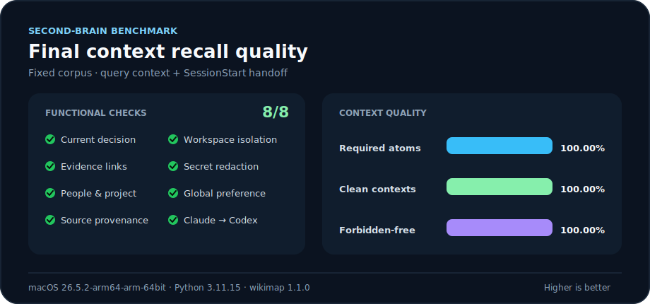
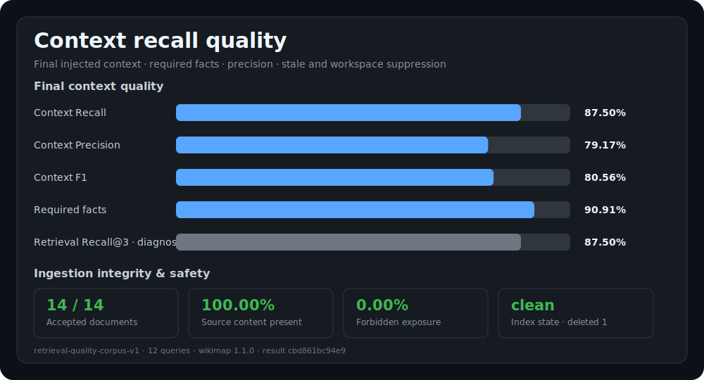

# WikiBrain

<p align="center">
  
</p>

<p align="center"><strong>オープンソース · ローカルファースト · ユーザー所有 · Markdown ネイティブ</strong></p>

<p align="center">
  <a href="README.md">English</a> ·
  <a href="README.ko.md">한국어</a> ·
  <strong>日本語</strong> ·
  <a href="README.zh-CN.md">简体中文</a>
</p>

WikiBrain は、Claude Code、Codex、Grok Build のための [MIT ライセンス](LICENSE)の共有セカンドブレインです。ライフサイクルフックを通じて機密情報をマスキングした会話の引き継ぎを取得し、永続的なコンテキストを読みやすい Markdown として保存し、ローカルで出典を認識した情報の呼び出しに [Wikimap](https://github.com/dhha22/wikimap) を使用します。

## 目次

- [WikiBrain を選ぶ理由](#why-wikibrain)
- [はじめに](#getting-started)
- [仕組み](#how-it-works)
- [短期記憶と長期記憶](#memory-lifecycle)
- [検証済みベンチマーク](#verified-benchmark)
- [インストールと信頼](#installation-and-trust)
- [日常的に使うコマンド](#daily-commands)
- [データとプライバシー](#data-and-privacy)
- [プロジェクトドキュメント](#project-documentation)

<a id="why-wikibrain"></a>

## WikiBrain を選ぶ理由

| ニーズ | WikiBrain が提供するもの |
| --- | --- |
| エージェントをまたいで作業を継続 | Claude、Codex、Grok が同じプロジェクトスコープのコンテキストを復元できます。 |
| 証拠と記憶を分離 | 90 日の証拠、適応型記憶、明示的な長期記憶を区別して保持します。 |
| ユーザーの所有権を維持 | Markdown が永続的な正本であり、Wikimap インデックスは破棄して再生成できます。 |
| 一時的な障害から復旧 | アーカイブ、昇格、リレーション整理の各アウトボックスが中断した処理を再試行します。 |
| ユーザー自身が制御 | 取得対象は許可リストで制限でき、一時停止、確認、プレビュー、削除が可能です。 |

WikiBrain はリポジトリをクロールせず、すべての会話を自動的に永続的な事実へ変換することもありません。取得されるのはライフサイクルのペイロードだけです。明示的な「これを覚えて」というリクエストはユーザー指定の長期記憶になり、繰り返し実際のコンテキストに注入された証拠は、別途ラベル付けされた適応型長期記憶になる場合があります。

<a id="getting-started"></a>

## はじめに

### 1. インストールと初期化

macOS または Linux：

```bash
brew install hungrytech/tap/wikibrain
brainctl init
brainctl doctor
```

ネイティブ Windows では、内容を確認できる [PowerShell インストーラー](#native-windows)を使用してください。`brainctl init` は明示的な同意の境界です。インストールしただけでは Claude や Codex の設定は変更されません。

### 2. 新しいエージェントセッションを開始

| クライアントモード | `brainctl init` 実行後 | 一度だけ必要な操作 |
| --- | --- | --- |
| Claude Code の自動記憶 | 新しいセッションで利用可能 | なし。確認には `/hooks` を使用できます。 |
| Codex の手動記憶 | すぐに利用可能 | `brainctl remember` と `brainctl recall` を使用します。 |
| Codex の自動取得と呼び出し | 定義はインストールされますが、最初は信頼されていません | 新しいセッションを開始し、`/hooks` を開いて、WikiBrain の 5 つのフックを確認し、現在のハッシュを信頼してください。 |
| Grok の自動取得 | Grok の Claude フック互換機能で利用可能。ネイティブ設定も対応 | デフォルト設定では追加操作不要。Grok 専用の場合だけ `brainctl setup --clients grok` を使用します。 |
| Grok の呼び出し | インストール済みスキルと `brainctl recall` が利用可能 | Grok は passive hook の stdout を無視するため、フックによる自動コンテキスト注入には対応しません。 |

### 3. スモークテストを実行

```bash
brainctl remember --global --title "WikiBrain smoke test" \
  "My WikiBrain verification marker is Cobalt-719."
brainctl recall "Cobalt-719"
```

結果には `Cobalt-719` とローカルの Markdown ソースが含まれるはずです。`remember` が返したドキュメント ID を使ってテストページを削除します：

```bash
brainctl forget --document DOCUMENT_ID --apply
```

<a id="how-it-works"></a>

## 仕組み

```text
Claude Code hooks ─┐
Codex hooks ───────┼─ brainctl ─┬─ SQLite WAL: receipts, queues, relations
Grok hooks ────────┘            ├─ Markdown vault: durable readable truth
                                └─ Wikimap: disposable local search index
```

1. `UserPromptSubmit` はプロンプトをマスキングして記録し、関連するプロジェクトの記憶を呼び出します。
2. `Stop` は最終応答をプロンプトと組み合わせ、そのターンを変更不可の Markdown 引き継ぎとしてアーカイブします。
3. 明示的な「覚えて」というリクエストは、独立した再試行キューを通じて永続的な記憶ページを作成します。繰り返し注入された短期証拠は、利用基準を満たすと別の適応型記憶ページになります。
4. `SessionStart` は同じ Git ワークスペースについて、最近のコンテキストとクエリに関連するコンテキストを復元します。
5. 型付きの `relates-to` および `supersedes` リンクは証拠を接続し、その出所を削除することなく古いガイダンスを抑制します。

[Grok Build 公式フック文書](https://docs.x.ai/build/features/hooks)は
`SessionStart`、`UserPromptSubmit`、`PostToolUse`、`Stop`、
`PostCompact` をサポートし、Claude Code のフックとスキルも自動的に読み込みます。
WikiBrain は Grok のフック環境を検出し、Claude 互換経路のイベントも provider
`grok` として記録します。ただし Grok は passive hook の stdout を無視します。
そのため Grok の証拠は自動取得しますが、届いていない呼び出しをコンテキスト注入として
数えたり、自動呼び出しと主張したりしません。以前のコンテキストが必要なときは、
Grok に WikiBrain スキルを使わせるか、`brainctl recall` を実行してください。
実測 runtime payload の event 値は `user_prompt_submit`、`stop` のような
lowercase で、WikiBrain が内部 lifecycle 名へ正規化します。`UserPromptSubmit` は
`prompt` と `promptId` を提供します。実測 `Stop` payload には `transcriptPath`、
`promptId`、`reason` がありますが assistant 本文はありません。そのため WikiBrain
は利用不可の placeholder を保存し、外部 transcript を自動では読みません。

Grok 専用の設定では、まず [Grok Build overview](https://docs.x.ai/build/overview)
に従って公式 `grok` 実行ファイルをインストールします。xAI の現在のコマンドは
`curl -fsSL https://x.ai/cli/install.sh | bash` です。リモート install script は
実行前に確認してください。その後 `brainctl init --clients grok` を使用します。Grok の Claude
フックスキャナーを無効にしていない限り、ネイティブ Grok フックと Claude フックを
同時にインストールしないでください。同じイベントで両方が実行される可能性があります。

各 Git リポジトリは独立した記憶スコープです。プロジェクトの境界を意図的に越えるのは `brainctl remember --global` だけです。フックはフェイルオープンです。不正な形式のイベント、ビジー状態のデータベース、Wikimap 実行ファイルの欠落、タイムアウトがコーディングエージェントを妨げることはありません。

永続化、削除、再試行、信頼境界の詳細は [ARCHITECTURE.md](ARCHITECTURE.md) を参照してください。

<a id="memory-lifecycle"></a>

## 短期記憶と長期記憶

| 層 | 保存する内容 | 有効期間 |
| --- | --- | --- |
| 短期記憶の証拠 | 機密情報をマスキングした session turn と compaction handoff | デフォルト 90 日 |
| 適応型長期記憶 | エージェントのコンテキストへ繰り返し渡された証拠の、長さを制限したマスキング済みスナップショット | 通常の retention 後も保持し、`adaptive` と表示 |
| 明示的な長期記憶 | 「覚えて」または `brainctl remember` でユーザーが指定した事実や設定 | 通常の retention 後も保持し、`explicit` と表示 |

### 適応型昇格の条件とスコア

自動昇格の対象は `session` と `handoff` の証拠だけです。ユーザーが明示的に
「覚えて」と指定した内容は、このスコアを経由せず `explicit` 長期記憶になります。
適応型候補はまず、直近 60 日以内に次のハードゲートをすべて満たす必要があります。

| ハードゲート | デフォルト |
| --- | ---: |
| 証拠を受け取った異なる consumer provider/session pair | 3 |
| 証拠が注入された異なる UTC 日 | 3 |
| 重複を除いた provider/session/day 単位の注入 | 2 |

ハードゲートを満たすだけでは昇格しません。WikiBrain は次の式を計算します。

```text
score = 0.30 * min(S / 6, 1)
      + 0.25 * min(D / 6, 1)
      + 0.25 * min(I / 4, 1)
      + 0.10 * (Q / S)
      + 0.10 * min(P / 2, 1)
```

| 記号 | 意味 |
| --- | --- |
| `S` | 証拠を受け取った異なる consumer provider/session pair 数 |
| `D` | 証拠が注入された異なる UTC 日数 |
| `I` | 重複を除いた provider/session/day 単位の注入数 |
| `Q` | 明示的 query の direct hit により証拠が注入された異なる consumer session 数 |
| `P` | 異なる consumer provider 数 |

分母の `6`、`6`、`4` は、それぞれデフォルトのハード最小値の 2 倍です。反復に関する
点数は利用に応じて徐々に増え、その値で飽和します。Provider の多様性は 2 provider
で飽和します。デフォルトの昇格条件は `score >= 0.65` です。
`adaptive_memory_min_score` でしきい値を 0 から 1 の範囲で変更でき、`0` にすると
従来のハードゲートのみの動作になります。

同じ provider/session pair が同じ UTC 日に証拠を再度受け取っても 1 回として数えます。
実際の consumer session identity がない手動 `brainctl recall` は数えません。最終
`<memory-data>` に入った証拠だけが点数に寄与し、query-backed の点数は明示的検索の
direct hit にだけ与えます。Related と recent fallback は含めません。Memory ページは
自身の昇格点数を増やせず、workspace 間の利用回数も合算しません。Superseded の証拠は
対象外です。昇格後に source が superseded された場合、派生した adaptive memory も
recall から隠します。

この式は学習済み確率ではなく、決定的な初期ポリシーです。昇格ページと document
metadata には合計点、しきい値、重み付き要素を記録します。しきい値未満の候補は
pending のまま残り、次回の利用時に再評価されます。

昇格では source で確認した証拠を最大 2,000 文字だけ新しい Markdown ページへ
保存し、source 文書 ID、利用回数、昇格時刻、`memory_kind: adaptive` を記録します。
これは繰り返し有用だったコンテキストであり、内容が真実だという自動判定では
ありません。元の 90 日証拠が期限切れになっても小さな適応型記憶は残ります。
通常の retention は削除しませんが、source を明示的に forget すると、派生した
適応型記憶も削除されます。

<a id="verified-benchmark"></a>

## 検証済みベンチマーク

<p align="center">
  
</p>

固定コーパスの契約ベンチマークは検索レイテンシではなく、エージェントに渡される最終 `<memory-data>` を検査します。クエリチェックでは最近の項目へのフォールバックを無効にし、別の引き継ぎチェックでは `SessionStart` による最近のコンテキスト復元を検証します。必要な事実がすべて存在し、古い指示、機密情報、別ワークスペースの内容が存在しない場合にのみ合格します。

| 最終コンテキスト契約 | 値 |
| --- | ---: |
| コンテキストチェック | **8/8 passed** |
| 必須コンテキスト atom | **21/21 · 100.00%** |
| Clean context | **8/8 · 100.00%** |
| 禁止 atom の露出 | **0/4 · 0.00%** |
| 環境 | macOS arm64 · Python 3.13.11 · Wikimap 1.1.0 |

### 正解ラベル付き最終コンテキスト品質

<p align="center">
  
</p>

別の 14 文書・12 クエリのコーパスは、本番の `RecallService.context()` が実際に注入する内容を測定します。各クエリには関連レコード、最低限必要な事実、禁止する stale、削除済み、別ワークスペースのレコードをラベル付けします。クエリ本文と最終コンテキスト本文は採点後に破棄します。

| 最終コンテキスト品質 | 値 |
| --- | ---: |
| Context Recall / Precision | **87.50% / 79.17%** |
| Context F1 / 必須事実 recall | **80.56% / 90.91%** |
| 禁止コンテキスト露出 | **0/12 queries · 0.00%** |
| 取り込み受理率 | **14/14 · 100.00%** |
| Retrieval Recall@1 / Recall@3 *(診断用)* | **69.44% / 87.50%** |
| MRR / nDCG@3 *(診断用)* | **87.50% / 81.35%** |

Context Recall は必要なレコードが最終プロンプトまで届いたかを測ります。Context Precision は注入されたレコードのうち関連レコードの割合です。必須事実 recall は、選択された文書の有用な証拠が欠落または切り詰められた場合も検出します。検索順位の指標は検索・ランキング原因を特定するための診断値であり、第二の脳の品質を代表する指標ではありません。

<details>
<summary><strong>8 件のチェックの対象</strong></summary>

| チェック | 契約 |
| --- | --- |
| 現在の決定 | 新しい `uv` ガイダンスが、置き換えられた `pip` ガイダンスを抑制します。 |
| 証拠リンク | `relates-to` と `supersedes` のエッジが呼び出し後も維持されます。 |
| 人とプロジェクト | オーナーと予備レビュアーのコンテキストを引き続き復元できます。 |
| 出典の来歴 | ドキュメント ID、Markdown パス、取得時刻が証拠に付随します。 |
| ワークスペースの分離 | 別のリポジトリのマーカーがスコープを越えません。 |
| シークレットのマスキング | 合成 API シークレットが永続ストレージにも呼び出し結果にも存在しません。 |
| グローバル設定 | 意図的に設定したグローバル設定をプロジェクトスコープで利用できます。 |
| Claude → Codex | Claude セッションの事実が Codex のセッション開始時に表示されます。 |

</details>

ソースをチェックアウトした環境で再現するには：

```bash
uv run --locked python -m benchmarks.second_brain \
  --format json \
  --output benchmarks/results/second-brain-v1.json
uv run --locked python scripts/render_benchmark_chart.py

uv run --locked python -m benchmarks.retrieval_quality \
  --corpus benchmarks/corpora/retrieval-quality-v1.json \
  --output benchmarks/results/retrieval-quality-v1.json
uv run --locked python scripts/render_retrieval_quality_chart.py
```

機械可読な結果は [`second-brain-v1.json`](benchmarks/results/second-brain-v1.json) と [`retrieval-quality-v1.json`](benchmarks/results/retrieval-quality-v1.json) にあります。どちらのグラフも対応する JSON から生成され、古い SVG は CI によって拒否されます。

自分が保存したデータの品質を測るには、[正解ラベル付きコーパス](benchmarks/corpora/retrieval-quality-v1.json)をリポジトリ外にコピーし、合成文書と relevance ラベルを置き換えて、結果をローカルに保存します：

```bash
cp benchmarks/corpora/retrieval-quality-v1.json /tmp/my-brain-quality.json
# /tmp の documents、queries、relevant、required_context、forbidden を編集します。
uv run --locked python -m benchmarks.retrieval_quality \
  --corpus /tmp/my-brain-quality.json \
  --output /tmp/my-brain-quality-result.json
```

結果には文書本文とクエリ本文は記録されませんが、ID も機密になり得ます。個人用コーパスや結果をコミットしないでください。

> **範囲：** これは小規模な合成回帰コーパスの結果であり、個人用 Vault の性能を保証するものではありません。OCR 抽出、同時書き込み、検索コンテキストを LLM が使用した後の回答の忠実性、マルチホップのグラフ推論は測定していません。自分のデータに対する精度を主張するには、自分で正解ラベルを付けた個人用コーパスが必要です。

<a id="installation-and-trust"></a>

## インストールと信頼

### macOS または Linux

上の [はじめに](#getting-started) にあるコマンドを使用してください。ビルド済みの bottle は Apple Silicon macOS、Intel macOS、x86_64 Linux に対応しています。

<a id="native-windows"></a>

### ネイティブ Windows

最も簡単な方法は、AI コーディングアシスタントに公式リポジトリのリンクを渡し、インストールと検証を依頼することです。Windows PC でコマンドを実行できる Claude Code、Codex などのエージェントに、次のプロンプトをそのまま貼り付けてください：

```text
Install WikiBrain on this Windows machine from https://github.com/hungrytech/wikibrain.
Read the repository's Native Windows instructions first. Before changing anything,
tell me whether native Windows or WSL is the correct path for where my agents and
repositories run. Use the version-pinned installer from the README. Download it,
show me the full PowerShell script, explain the settings changed by initialization,
then stop and wait for my explicit approval before running the script or initializing
WikiBrain. After I approve, install it and finish by running brainctl doctor.
Do not bypass Codex hook trust.
```

AI が提示した計画と権限要求を確認してから進めてください。手動でインストールする場合は、PowerShell を開き、バージョンが固定されたインストーラーをダウンロードして内容を確認した後、実行します：

```powershell
$installer = Join-Path $env:TEMP "install-wikibrain.ps1"
Invoke-WebRequest `
  "https://raw.githubusercontent.com/hungrytech/wikibrain/v0.1.4/scripts/install-windows.ps1" `
  -OutFile $installer
Get-Content $installer
powershell.exe -NoProfile -ExecutionPolicy Bypass `
  -File $installer -Initialize
```

インストーラーは Python 3.11 以降を使用し、分離された `pipx` を通じてインストールします。`brainctl init` を実行するのは `-Initialize` が指定された場合だけです。エージェント設定を変更せずに CLI をインストールするには、このスイッチを省略してください。ネイティブ Windows では Brain は `%LOCALAPPDATA%\WikiBrain` に保存されます。エージェントとリポジトリを WSL 内で実行する場合は、Linux のパスを使用してください。

<details>
<summary><strong>Codex フックの信頼境界</strong></summary>

手動の `brainctl remember` と `brainctl recall` は、フックを承認しなくても動作します。一方、自動的なプロンプトの取得とコンテキスト注入は動作しません。Codex は、現在の定義ハッシュが `/hooks` で確認されるまで、管理対象外のコマンドフックをスキップします。

WikiBrain がエイリアス、ラッパー、起動設定に `--dangerously-bypass-hook-trust` を追加することはありません。永続的にレビューを不要にする唯一の方法は、システム、MDM、クラウド、または `requirements.toml` を通じて配布される、管理者が管理するフックポリシーです。

保留中のフック警告がない、信頼承認不要の手動専用セットアップ：

```bash
brainctl init --clients codex --no-hooks
brainctl remember --global "A durable fact"
brainctl recall "that durable fact"
```

公式の [Codex フックドキュメント](https://learn.chatgpt.com/docs/hooks)を参照してください。

</details>

### `brainctl init` による変更

`brainctl init` は冪等です。既存の設定をバックアップし、WikiBrain が所有するエントリだけを構造的にマージし、無関係なフックとスキルを保持します。

| 用途 | macOS/Linux | ネイティブ Windows |
| --- | --- | --- |
| Brain の状態 | `~/.local/share/wikibrain/` | `%LOCALAPPDATA%\WikiBrain\` |
| Claude フック | `~/.claude/settings.json` | `%USERPROFILE%\.claude\settings.json` |
| Codex フック | `~/.codex/hooks.json` | `%USERPROFILE%\.codex\hooks.json` |
| Grok フック（Grok 専用 opt-in） | `${GROK_HOME:-~/.grok}/hooks/wikibrain.json` | `%GROK_HOME%\hooks\wikibrain.json` または `%USERPROFILE%\.grok\hooks\wikibrain.json` |
| Claude スキル | `~/.claude/skills/wikibrain/` | `%USERPROFILE%\.claude\skills\wikibrain\` |
| Grok スキル（Grok 専用 opt-in） | `${GROK_HOME:-~/.grok}/skills/wikibrain/` | `%GROK_HOME%\skills\wikibrain\` または `%USERPROFILE%\.grok\skills\wikibrain\` |
| Codex/Agents スキル | `~/.agents/skills/wikibrain/` | `%USERPROFILE%\.agents\skills\wikibrain\` |

| イベント | WikiBrain の動作 |
| --- | --- |
| `SessionStart` | セッションを登録し、関連するプロジェクトの記憶を注入します。 |
| `UserPromptSubmit` | プロンプトをマスキングして取得した後、コンテキストを呼び出します。 |
| `PostToolUse` | 安全なツール、ファイル、作業ディレクトリへのポインターだけを保存します。 |
| `Stop` | 完了したターンをアーカイブし、明示的な記憶を昇格させ、検索を更新します。 |
| `PostCompact` | 利用可能なコンパクション要約を引き継ぎとしてアーカイブします。 |

WikiBrain が所有する連携だけを確認または削除するには：

```bash
brainctl init --dry-run --json
brainctl hooks status
brainctl hooks uninstall
brainctl skills uninstall
```

### ローカル開発

```bash
uv sync --locked
uv run brainctl init
uv run python -m unittest discover -s tests -v
```

<a id="daily-commands"></a>

## 日常的に使うコマンド

```bash
brainctl status
brainctl recall "what did we decide about the auth architecture?"
brainctl remember --title "Preferred package manager" "Use uv for Python tools."
brainctl remember --global "I prefer concise Korean answers."
brainctl remember --title "Use uv" \
  --relates-to evidence-ID --supersedes old-ID "Use uv."
brainctl pause
brainctl resume
brainctl forget --document memory-ID            # preview
brainctl forget --document memory-ID --apply
brainctl forget --document memory-ID --cascade  # preview source session
brainctl forget --document memory-ID --cascade --apply
brainctl retention                               # preview 90-day evidence pruning
brainctl retention --apply
```

<a id="data-and-privacy"></a>

## データとプライバシー

- 機密情報は SQLite または Markdown への書き込み前にマスキングされます。
- ツールの完全な出力とシェルコマンドはアーカイブされません。安全なポインターだけが保存されます。
- アーカイブはマスキング済みの平文であり、アプリケーションレベルでは暗号化されていません。FileVault、BitLocker、または LUKS を使用してください。
- `remember` はデフォルトでプロジェクトスコープです。`--global` は意図した場合にだけ使用してください。
- 保持処理は期限切れのセッションと引き継ぎの証拠を削除しますが、適応型と明示的な長期記憶は保持します。また、`--apply` を付けない限りプレビューのみです。期限の基準は後から登録された時刻ではなく証拠の `captured_at` であり、失敗した promotion が古い turn を無期限に保護することはありません。
- 完了済みの handoff 行はドキュメント metadata に集約されます。削除された source ごとに replay 防止用の canonical tombstone を 1 行保持し、内容がなくなった session の tombstone は retention が session tombstone 1 行に再集約します。期限切れにすると replay された内容が復活し得るため fingerprint は失効させません。forget receipt は最新 100 件、installer backup は対象ごとに最新 3 件だけを残し、retention 後の空の日付ディレクトリは削除します。
- 短期証拠を明示的に forget すると、そこから派生した適応型記憶も削除します。通常の memory 削除ではそのページだけを削除します。`--cascade` で source session 全体への影響をプレビューし、同じコマンドに `--apply` を追加して削除してください。
- 状態の保存場所は `WIKIBRAIN_HOME` または `brainctl --home PATH` で上書きできます。

Homebrew または pipx をアンインストールしても、別に保存されている Brain ディレクトリは削除されません。

<a id="project-documentation"></a>

## プロジェクトドキュメント

- [アーキテクチャと信頼境界](ARCHITECTURE.md)
- [コマンドリファレンス](plugins/wikibrain/skills/wikibrain/references/command-reference.md)
- [セキュリティポリシー](SECURITY.md)
- [コントリビューション](CONTRIBUTING.md)
- [変更履歴](CHANGELOG.md)

WikiBrain は [MIT License](LICENSE) の下で配布されています。
